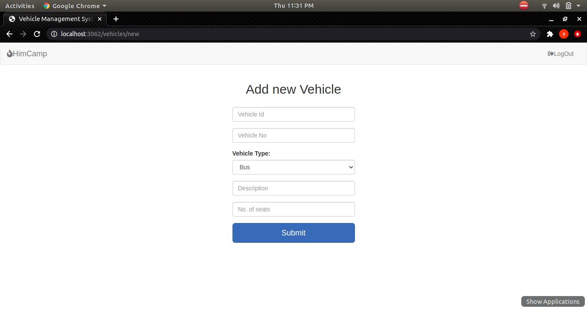

# Vehicle-Management-System
Developed using HTML, CSS, Javascript, ejs, nodejs, mysql. 
All the different frames built are shown in image.
  
<h1 align="center">USER</h1>

  

  

    
<h1 align="center">EMPLOYEE</h1>

  

  
     
<h1 align="center">ADMIN</h1>

  

